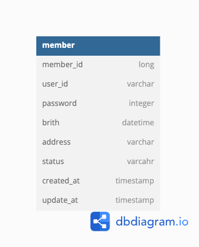

# [금 거래 웹 서비스]

금방주식회사 백엔드 입사과제

 

## 목차
- [개요](#개요)
- [시나리오](#시나리오)
- [기술 스택](#기술-스택)
- [데이터베이스 모델링](#데이터베이스-모델링)
- [구현 기능](#구현-기능)

 

## 개요
- 금 거래 웹 서비스
- **Port** : 8888
- **Grpc Port** : 50051
- 개발기간 : 2024.09.4 ~ 2024.09.11
   

## 시나리오
1. 자원 서버의 grpc 사용자 인증 및 인가 요청 처리
    

## 기술 스택
언어 및 프레임워크:   
데이터 베이스:   
기타 :   
 

## 데이터베이스 모델링

 

## 구현 기능
1. 자원 서버로 부터 grpc 회원 가입 요청 시 DB 회원 정보 저장
   1. 로그인 이전 사용자 상태 : INIT
   2. 로그인 이후 사용자 상태 : USE
2. 자원 서버로 부터 grpc 로그인 요청시 jwt 생성
   1. access: userId,address, expired(1hour)
   2. refresh: userId, expired(7day)
3. access token 만료 시 refresh token을 통한 재발급
    

